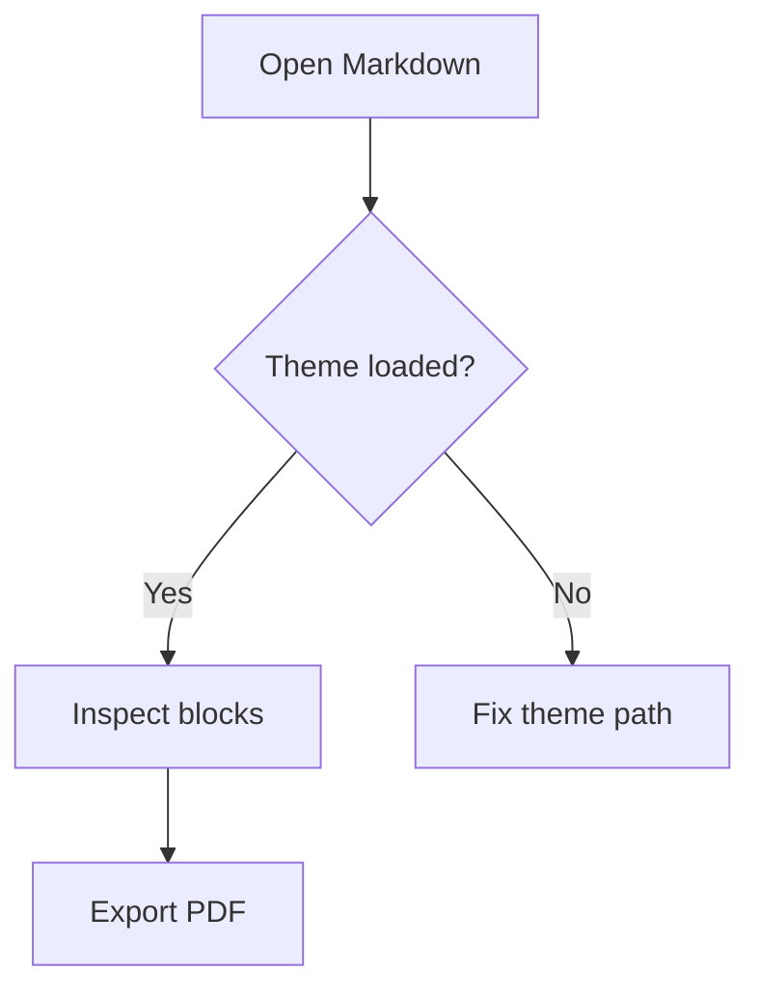
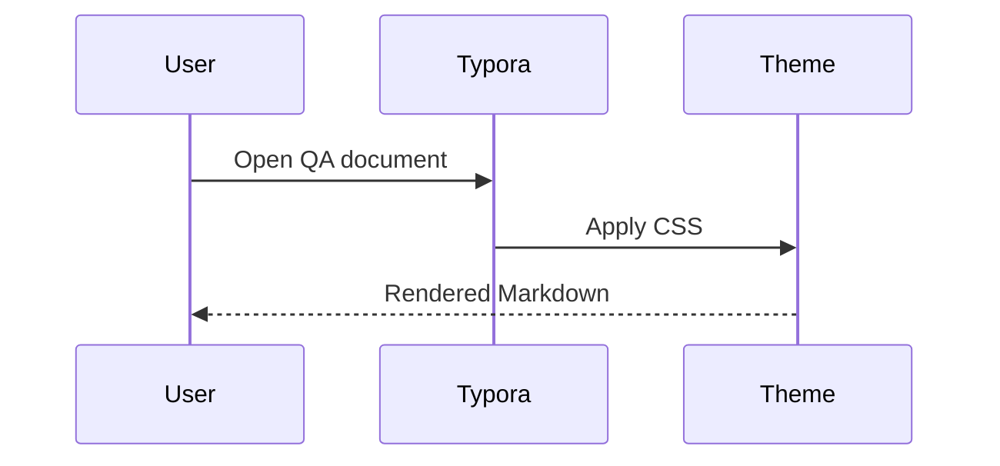
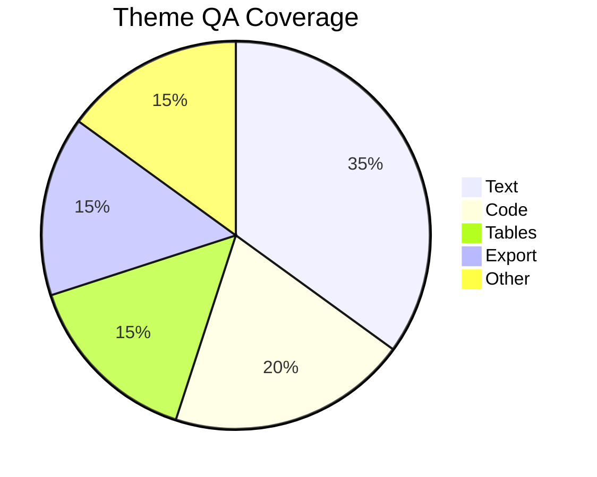
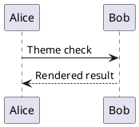
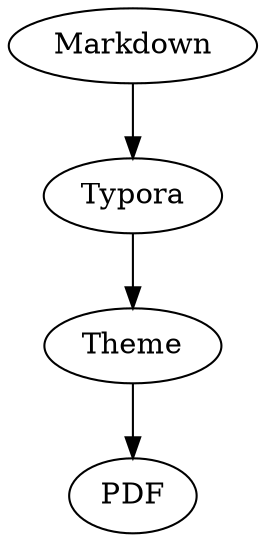
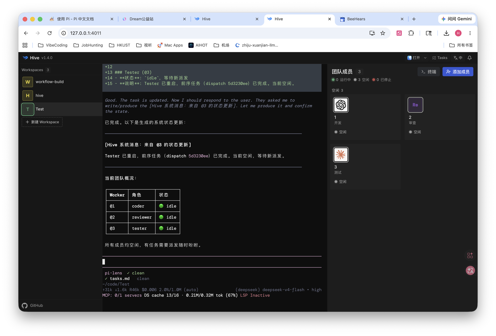

# Claude Typora Theme QA

[TOC]

## QA Checklist

Use this file to inspect the Claude Typora theme in normal editing mode, source mode, focus mode, typewriter mode, outline/sidebar views, and PDF export.

- [ ] Light theme body text is readable.
- [ ] Dark theme body text is readable.
- [ ] Sidebar, outline, search results, and file tree remain legible.
- [ ] Inline code, code blocks, tables, links, and blockquotes have enough contrast.
- [ ] Long lines, long URLs, and wide tables do not break the layout.
- [ ] PDF export keeps backgrounds, borders, page breaks, and link colors readable.

---

## Headings

# Heading Level 1

## Heading Level 2

### Heading Level 3

#### Heading Level 4

##### Heading Level 5

###### Heading Level 6

### Heading With Inline Styles: **Bold**, *Italic*, `Code`, [Link](https://example.com)

The outline sidebar should show all heading levels with stable indentation. Heading spacing should make sections scannable without creating excessive blank space.

---

## Paragraphs And Inline Styles

This document is a broad visual checklist for Markdown content that commonly appears in notes, articles, technical documents, plans, specs, and exported PDFs.

中文段落用于检查中英混排、行高、字重、标点、链接样式和代码样式。 This sentence includes **bold text**, *italic text*, ***bold italic text***, ==highlighted text==, <u>underlined text</u>, ~~deleted text~~, `inline code`, and a [sample link](https://example.com).

Inline HTML often appears in Markdown documents: <kbd>Cmd</kbd> + <kbd>K</kbd>, <mark>marked text</mark>, H<sub>2</sub>O, x<sup>2</sup>, <small>small text</small>, and <abbr title="HyperText Markup Language">HTML</abbr>.

Long words and paths should not overflow their containers: `/Users/mac/Library/Application Support/abnerworks.Typora/themes/CLAUDE-Typora/claude-theme-qa.md`.

A long URL should wrap safely without forcing horizontal scrolling: https://example.com/articles/typora-theme-quality-assurance/very/long/path/with/query?theme=claude&mode=dark&export=pdf&table=wide&code=enabled

Escaped Markdown characters should remain clear: \*literal asterisks\*, \_literal underscores\_, \# not a heading, and \[not a link\].

---

## Links

External link: [Example Domain](https://example.com).

Internal heading link: [Jump to Export Notes](#export-notes).

Email link: <hello@example.com>.

Bare URL: https://typora.io

Reference style link: [Typora][typora-ref].

[typora-ref]: https://typora.io "Typora"

---

## Lists

1. Ordered item with a short sentence.
2. Ordered item with inline code: `npm run theme:check`.
3. Ordered item with nested content.
   - Nested unordered item.
   - Nested unordered item with **strong emphasis**.
   - Nested unordered item with a continuation paragraph.

     The continuation paragraph should align with the nested item, not with the page edge.
4. Ordered item after nested content should keep correct numbering.

- Unordered item.
- Unordered item with a paragraph below.

  This continuation paragraph checks nested spacing.

- Unordered item with a nested ordered list.
  1. Nested ordered item.
  2. Nested ordered item with `inline code`.

- [ ] Open this document in Typora.
- [x] Toggle between `claude` and `claude-dark`.
- [ ] Inspect source mode.
- [x] Export to PDF and inspect tables, code blocks, links, and page breaks.

Mixed task nesting:

- [ ] Parent task
  - [x] Finished child task
  - [ ] Open child task
    - [ ] Deep child task

---

## Definition Style Content

Term
: Definition text used by some Markdown processors.

Theme
: A visual system for body text, headings, code, tables, quotes, sidebars, and exports.

Keyboard shortcut
: <kbd>Cmd</kbd> + <kbd>/</kbd> should look compact and clickable without feeling like a button.

---

## Blockquotes

> A good writing theme should stay quiet while editing, but still make structure easy to scan.
>
> - Quoted list item
> - Quoted item with `inline code`
>
> > Nested quote should be visibly nested without becoming heavy.

> **Note:** This quote checks bold text, punctuation, and link color inside a quote: [inside quote](https://example.com).

---

## Callout-Like Blocks

Typora does not standardize callouts across every Markdown dialect, but many documents include callout-like blockquotes.

> [!NOTE]
> Notes should be readable even if the theme does not add special callout styling.

> [!TIP]
> Tip content should not collide with quote markers or list indentation.

> [!WARNING]
> Warning content should remain readable in both light and dark themes.

---

## Tables

| Area | Expected Result | Risk |
| --- | --- | --- |
| Body text | Comfortable measure and readable line height | Font fallback can change spacing |
| Code block | Language label is visible and stable | Typora DOM changes can affect tooltip placement |
| Sidebar | Floating panel has enough top spacing | macOS title bar offset can vary |
| PDF export | Theme background is uniform across page boundary and body; code and table borders stay readable | Export engines may drop background colors |

Alignment table:

| Left | Center | Right |
| :--- | :---: | ---: |
| Alpha | Beta | 123 |
| Longer text | Centered text | 45.67 |
| `inline code` | **bold** | [link](https://example.com) |

Wide table:

| Column A | Column B | Column C | Column D | Column E | Column F |
| --- | --- | --- | --- | --- | --- |
| This cell contains a long sentence that checks wrapping. | Short | `code` | **strong** | [link](https://example.com) | 中文内容测试 |
| Another row | LongLongLongLongLongLongLongWord | 2026-05-22 | Pending | Done | Notes |

Table with empty cells:

| Name | Owner | Status | Notes |
| --- | --- | --- | --- |
| Theme QA | mac | Active | Full document |
| Empty owner |  | Draft |  |

---

## Code Blocks

Plain code block:

```
No language code block.
It should still look intentional.
```

JavaScript:

```javascript
function summarizeTheme(theme) {
  const result = {
    name: theme.name,
    hasPrintStyles: true,
    accent: "#D97757",
  };

  return `${result.name}: ${result.hasPrintStyles ? "ready" : "needs work"}`;
}
```

CSS:

```css
:root {
  --accent-color: #D97757;
  --quote-border: #1f1e1d1a;
}

blockquote {
  border-color: var(--quote-border);
}
```

Python:

```python
from dataclasses import dataclass

@dataclass
class ThemeResult:
    name: str
    passed: bool

print(ThemeResult("claude", True))
```

Shell:

```bash
cd "/Users/mac/Library/Application Support/abnerworks.Typora/themes/CLAUDE-Typora"
ls -la
```

JSON:

```json
{
  "theme": "claude",
  "modes": ["light", "dark", "pdf"],
  "passed": true
}
```

Diff:

```diff
- color: #444;
+ color: var(--text-color);
```

Long code line:

```text
ThisIsAVeryLongCodeLineThatShouldEitherScrollInsideTheCodeBlockOrWrapOnlyIfTheThemeExplicitlyChoosesToWrapCodeBlocksWithoutBreakingThePageLayout
```

---

## Math

Inline math: $E = mc^2$, $\alpha + \beta = \gamma$, and $\frac{a}{b}$.

Block math:

$$
\int_0^1 x^2\,dx = \frac{1}{3}
$$

Matrix:

$$
\begin{bmatrix}
1 & 2 & 3 \\
4 & 5 & 6
\end{bmatrix}
$$

Multi-line equation:

$$
\begin{aligned}
f(x) &= x^2 + 2x + 1 \\
     &= (x + 1)^2
\end{aligned}
$$

---

## Footnotes

Footnote markers should be readable inline and the hover preview should not inherit code-block language label positioning.[^theme]

Multiple footnotes should not crowd line height.[^second]

[^theme]: This footnote exists to test inline footnote chips and hover popups in both light and dark themes.

[^second]: A second footnote checks spacing between footnote definitions.

---

## Images

Local image:


Image with title:


Broken image reference should be visually obvious but not destroy layout:


Linked image:

[](https://example.com)

---

## Horizontal Rules

Text before rule.

---

Text after rule.

***

Text after star rule.

___

Text after underscore rule.

---

## HTML Blocks

<details>
<summary>Expandable details block</summary>

This content checks native HTML rendering inside Markdown. It includes **Markdown-like text**, but rendering depends on Typora's parser.

</details>

<div>
  <p>Inline HTML paragraph inside a div.</p>
  <p><strong>Bold HTML</strong> and <code>HTML code</code>.</p>
</div>

---

## Mermaid Diagrams

Flowchart:



Sequence diagram:



Pie chart:



---

## Diagrams In Other Fences

Some Markdown files contain diagram fences even if Typora does not render every one of them. They should still look good as code blocks.





---

## Special Characters

Punctuation: “curly quotes”, ‘single quotes’, ellipsis..., dash - hyphen, en dash, em dash.

Symbols: © ® ™ § ¶ † ‡ ± × ÷ ≈ ≠ ≤ ≥ → ← ↑ ↓.

CJK punctuation: 你好，世界。“主题测试”：字体、间距、标点、链接、代码。

Emoji-style text: :smile: :warning: :rocket:

---

## Mixed Content Stress Test

1. A list item with a quote.

   > Quote inside list item.
   >
   > ```js
   > console.log("quoted code");
   > ```

2. A list item with a table.

   | Item | Status |
   | --- | --- |
   | Nested table | Check spacing |

3. A list item with math.

   $$
   a^2 + b^2 = c^2
   $$

---

## Long Section For Outline

### Outline Level Three

The outline sidebar should show nested headings with stable indentation and no visual overlap.

#### Outline Level Four

This level checks smaller heading weights, outline tree connectors, and TOC nesting.

##### Outline Level Five

Deep heading levels should remain visibly different without becoming noisy.

###### Outline Level Six

The smallest heading should still look like a heading, not body text.

---

## Page Break And Print Test

The following HTML page break is commonly used in Markdown documents prepared for PDF export.

<div style="page-break-after: always;"></div>

After the page break, the theme should keep the same background, margins, font choices, and table/code readability.

## Export Notes

When exporting this document, check that the PDF keeps the active theme background uniformly across page boundaries and body. Links should remain legible, tables should keep visible borders, code blocks should not split awkwardly across pages, and math/diagram blocks should not overflow.

Inspect these views before considering the theme ready:

1. Typora normal edit view.
2. Typora source mode.
3. Focus mode and typewriter mode.
4. Outline sidebar and file tree.
5. Light theme PDF export.
6. Dark theme PDF export, if supported.



